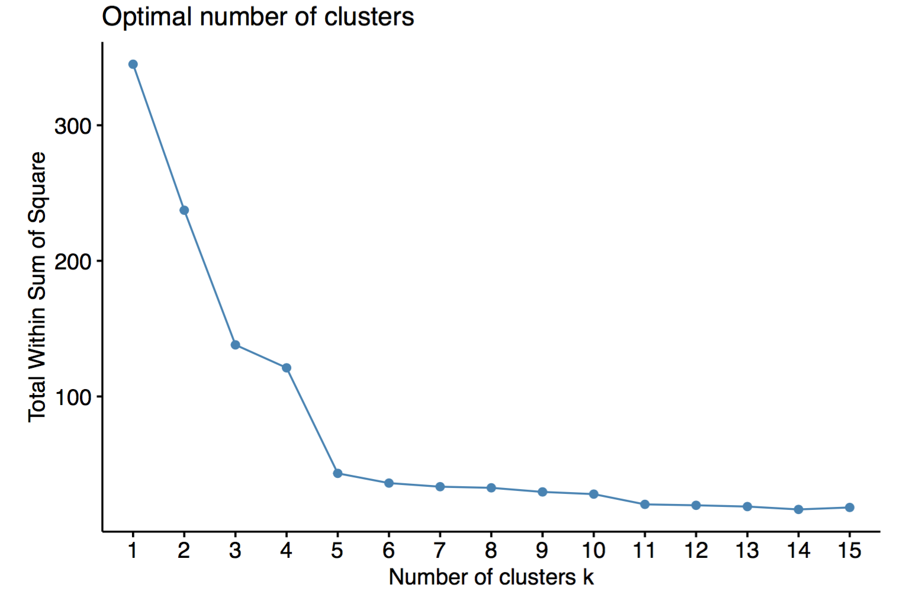
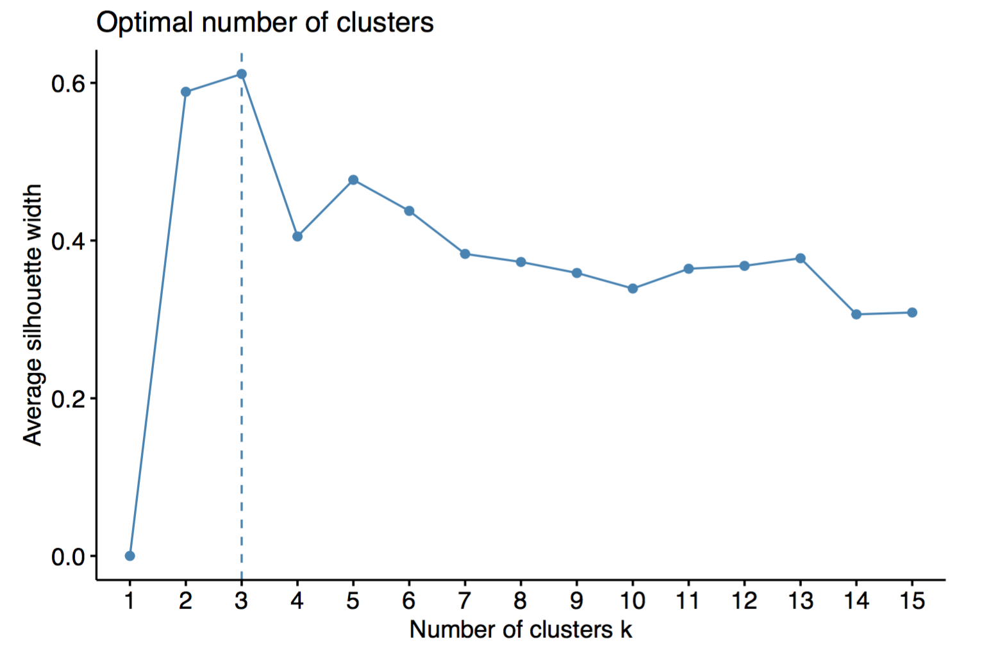
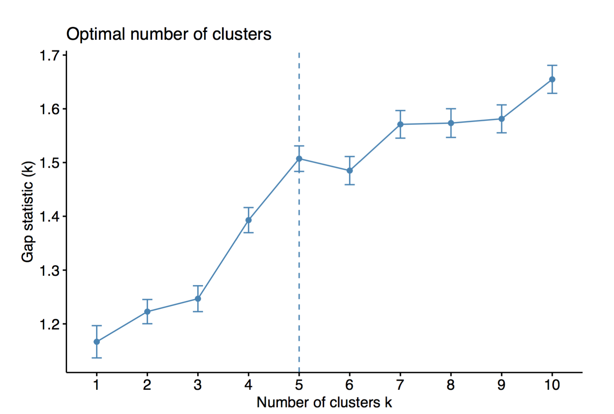
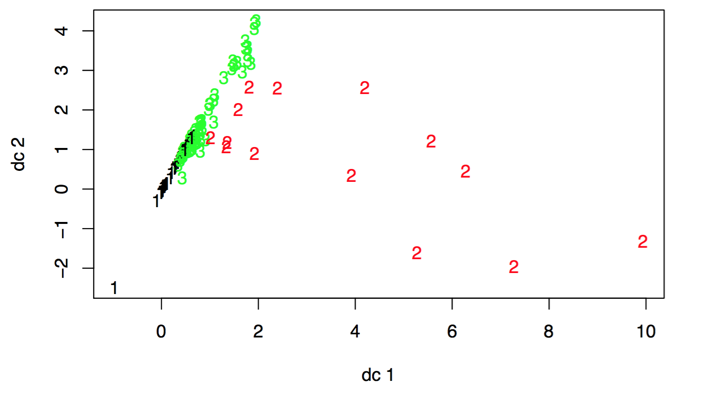
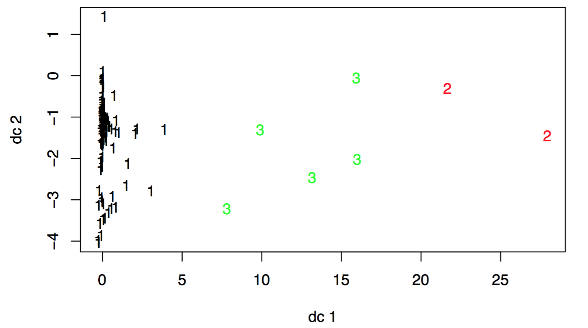
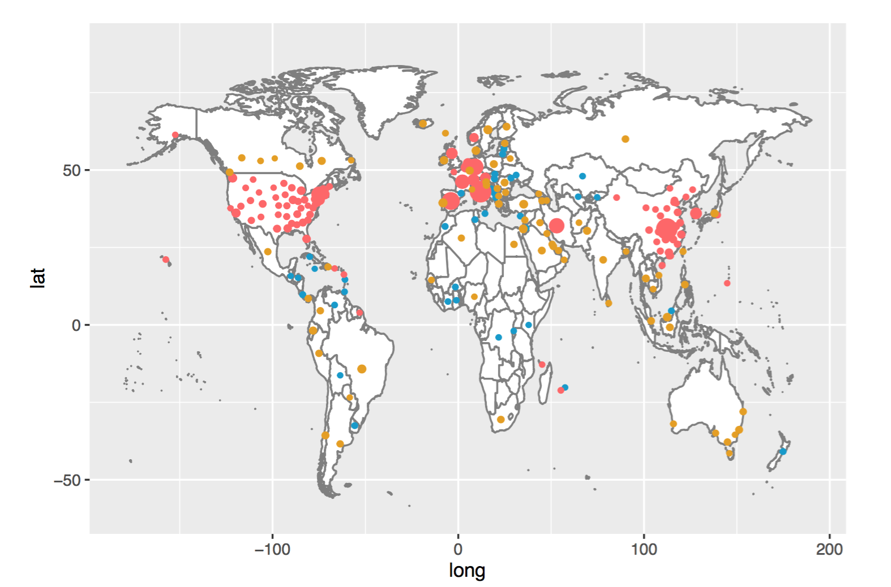
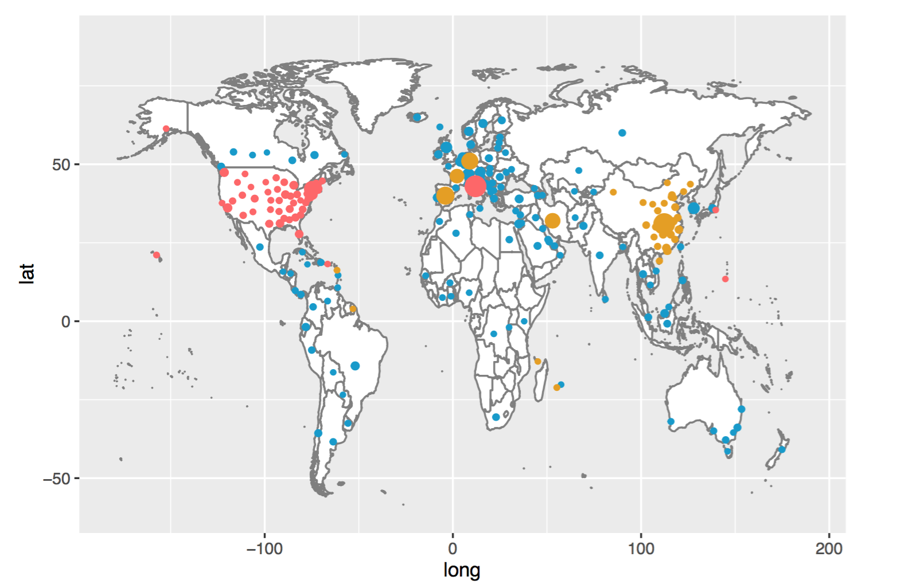

# Objective

# Statistical Methods 

## Adam Algorithm


## Guassian mixture model (with EM algorithm)

Cluster analysis is a method for finding clusters with similar characters within a dataset. And clustering methods can be divided into probability model-based approaches and nonparametric approaches[1]. The probability model-based approach contains Gussian Mixture Method, which assumes that the dataset follows a gussian mixture mixture distributions. 

Given that $\{\mathbf x_1,\mathbf x_2,...,\mathbf x_n \} \in \mathbb R^p$ be a collection of  $p$ dimensional data points. Assuming the following equation: 
$$x_i\sim
\begin{cases}
N(\boldsymbol \mu_1, \Sigma_1), \mbox{with probability }p_1 \\
N(\boldsymbol \mu_2, \Sigma_2), \mbox{with probability }p_2\\
\quad\quad\vdots\quad\quad,\quad\quad \vdots\\
N(\boldsymbol \mu_k, \Sigma_k), \mbox{with probability }p_k\\
\end{cases}
$$
$\sum_{j=1}^kp_j =1$

\vspace{10pt}

Let $\mathbf r_i = (r_{i,1},...,r_{i,k})\in \mathbb R^k$  as the cluster indicator of $\mathbf x_i$, which  takes form $(0, 0,...,0,1,0,0)$ with $r_{i,j} =I\{ \mathbf x_i\mbox{ belongs to  cluster } j\}$. The cluster indicator $\mathbf r_i$ is a latent variable that cannot be observed. What is complete likelihood of $(\mathbf x_i,\mathbf r_i)$. 

The distribution of $\mathbf r_i$ is $$f(\mathbf r_i) = \prod_{j= 1}^k p_j^{r_i,j}$$

The complete log-likelihood is 

$$\ell(\theta; \mathbf x,\mathbf r) = \sum_{i=1}^n \sum_{j=1}^k r_{i,j} [\log p_i + \log  f(\mathbf x_i; \boldsymbol \mu_j, \Sigma_j)] = \sum_{i=1}^n \sum_{j=1}^k r_{i,j} [\log p_i-1/2\log|\Sigma|-1/2 (\mathbf x_i-\boldsymbol \mu_j)^\top\Sigma (\mathbf x_i-\boldsymbol \mu_j)]$$

**E-step** Evaluate the responsibilities using the current parameter values

$$\gamma_{i, k} ^{(t)}= P(r_{i,k}=1 |\mathbf x_i,  \theta^{(t)}) =  
\frac{p_k^{(t)}f(\mathbf x_i|\boldsymbol \mu_k^{(t)}, \Sigma_k^{(t)})}
{\sum_{j=1}^K f(\mathbf x_i|\boldsymbol \mu_j^{(t)}, \Sigma_j^{(t)})}$$

**M-step** 

$\theta^{(t+1)} = \arg\max\ell( \mathbf{x}, \mathbf{\gamma}^{(t)}, \theta )$.

Let $n_k = \sum_{i=1}^n \gamma_{i, k}$, we have

$$\boldsymbol \mu_k^{(t+1)} = \frac{1}{n_k} \sum_{i=1}^n \gamma_{i, k} \mathbf x_i$$
$$\Sigma_k^{(t+1)} = \frac{1}{n_k} \sum_{i=1}^n \gamma_{i, k} (\mathbf x_i - \boldsymbol \mu_k^{(t+1)})(\mathbf x_i - \boldsymbol \mu_k^{(t+1)})^T$$

$$p_k^{(t+1)} = \frac{n_k}{n}$$

## K-mean

The $K$-means algorithm partitions data into $k$ clusters ($k$ is predetermined). We denote $\{\boldsymbol \mu_1, \boldsymbol \mu_2,...,\boldsymbol \mu_k\}$ as the  centers of the $k$ (unknown) clusters, and denote $\mathbf r_i = (r_{i,1},...,r_{i,k})\in \mathbb R^k$  as the ``hard'' cluster assignment of $\mathbf x_i$. 

$k$-means finds cluster centers and cluster assignments that minimize the objective function
$$J(\mathbf r, \boldsymbol \mu) = \sum_{i=1}^n\sum_{j=1}^kr_{i,j}\|\mathbf x_i-\mu_k\|^2$$

K-means is a special case for Gussian Mixture. It is not required to consider small variances or the limit case of zero variances.

## Method to select number of clusters

\begin{enumerate}
\item The Elbow Method

Calculate the Within-Cluster-Sum of Squared Errors (WSS) for different values of k, and choose the k for which WSS becomes first starts to diminish.

\item The Silhouette Method

The silhouette value measures how similar a point is to its own cluster (cohesion) compared to other clusters (separation).

\item Gap Statistic Method

The idea of the Gap Statistic is to compare the within-cluster dispersion to its expectation under an
appropriate null reference distribution.

\end{enumerate}

## Dunn Index

The Dunn index (DI) is a metric for evaluating clustering algorithms. It is an internal evaluation scheme, where the result is based on the clustered data itself. It aims to identify sets of clusters that are compact, with a small variance between members of the cluster, and well separated, where the means of different clusters are sufficiently far apart, as compared to the within cluster variance. For a given assignment of clusters, a higher Dunn index indicates better clustering. 

# Result

## Task 1:

## Task 2:

In order to choose the best clustering number, we use three different methods: The Elbow Method, The Silhouette Method and Gap Statistic Method. From the results (\textbf{Fig. 1,2,3}), we finally choose three as our clustering number, given that when clustering number is five, there will be NA in GMM method. 

The centering points of GMM and Kmeans method is shown in (\textbf{Table. 1}), and classification result of each country using these two method is shown in (\textbf{Table. 2}) and (\textbf{Fig. 4,5}). And the geographical distribution of countries in these classes using these two method can be seen in (\textbf{Fig. 6}) and (\textbf{Fig. 7}), in which blue points are countries in class one, red points are countries in class two and yelloe points are countries in class three. 

To compare GMM and Kmeans method, we used Dunn Index method. From  (\textbf{Table. 3}), we can see that the Dunn Index of Kmeans is higher than that of GMM. The reason may be that our data don't follow Gussian distribution. So we choose Kmeans to cluster our character value of each country. From (\textbf{Fig. 7}) and (\textbf{Table. 2}), we can see that Italy and US fall into class two, and China, France, Germany, etc fall into class three. The reason may be that Italy and US have higher growth rate and larger maximum cases value according to the given dataset. There is two types of countries in class three: one is that they have already arrived maximum point and their start time is relatively earlier than other countries, such as China and South Korea, another is that they are still in early stage and still lack of detection of covid-19, so their data may not be accurate and will increase quickly later due to more and more test, such as Spain and France.

# Discussion

## Task 1: 

## Task 2:

According to Kmeans CLassification, we have three clusters in these countries with different maximum cases, growth rate and mid-point. But due to the inaccurate data in early stage of some countries, we may get inaccurate estimate of a, b, c value, which leads to wrong classification of some countries, such as Spain and France. And Kmeans clustering also has some disadvantages, one of them is that this method assumes the clusters as spherical, so does not work efficiently with complex geometrical shaped data. 

\clearpage

# Figures


```{r , echo=FALSE, fig.cap="WSS results", out.width='90%', fig.pos='h', fig.align = "center"}

```

```{r , echo=FALSE, fig.cap="Result of Silhouette Method", out.width='90%', fig.pos='h', fig.align = "center"}

```

```{r , echo=FALSE, fig.cap="Result of Gap Statistic Method", out.width='90%', fig.pos='h', fig.align = "center"}

```

```{r , echo=FALSE, fig.cap="Classification of GMM", out.width='90%', fig.pos='h', fig.align = "center"}

```

```{r , echo=FALSE, fig.cap="Classification of Kmeans", out.width='90%', fig.pos='h', fig.align = "center"}

```

```{r , echo=FALSE, fig.cap="World map of classification using GMM method", out.width='90%', fig.pos='h', fig.align = "center"}

```

```{r , echo=FALSE, fig.cap="World map of classification using Kmeans method", out.width='90%', fig.pos='h', fig.align = "center"}

```

\clearpage

# Table 

\begin{center}
\includegraphics{./Plots/mean_value.jpg}
\end{center}
\begin{center}
Table 1. Centering point result
\end{center}

\begin{center}
\includegraphics{./Plots/class1.jpg}
\end{center}
\begin{center}
Table 2. Classification result
\end{center}

\begin{center}
\includegraphics{./Plots/class2.jpg}
\end{center}
\begin{center}
Table 2. Classification result
\end{center}

\begin{center}
\includegraphics{./Plots/class3.jpg}
\end{center}
\begin{center}
Table 2. Classification result
\end{center}

\begin{center}
\includegraphics{./Plots/dunn_index.jpg}
\end{center}
\begin{center}
Table 3. Dunn Index Result
\end{center}

## References
\begin{enumerate}
\item[1] Miin-ShenYang, Chien-YoLai, Chih-YingLin. "A robust EM clustering algorithm for Gaussian mixture models." Pattern Recognition (2012).
\end{enumerate}